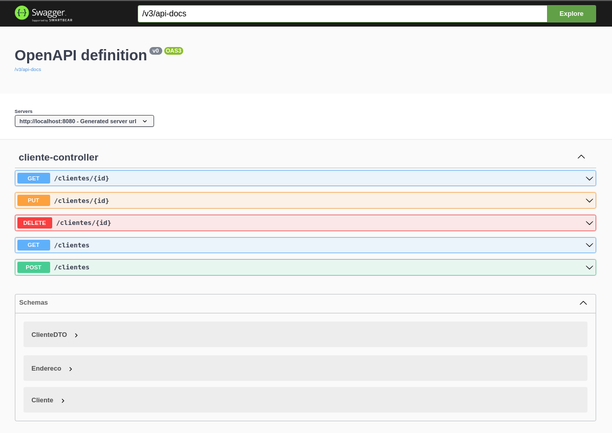

## Explorando Padrões de Projetos na Prática com Java. 
### Implementações dos padrões de projeto explorados em uma API REST com Spring Framework. 

Este projeto explorou os seguntes padrões:
- Singleton
- Strategy/Repository
- Facade 
##
O projeto faz parte do treinamento de Java com [Spring Boot](https://spring.io/) da [**Digital Innovation One**](https://digitalinnovation.one) e ministrado por **Venilton FalvoJr**.
Foi desenvolvido um pequeno sistema para o gerenciamento de clientes e seus endereços.
O sistema faz o consumo a API do [ViaCEP](https://viacep.com.br) para gerenciar um endereço a partir do CEP informado. 

##

Foram necessários os seguintes pré-requisitos para o desenvolvimento e versionamento do projeto:
- Java 11 ou versões superiores.
- Maven 3.6.3 ou versões superiores.
- Intellj IDEA Community Edition.
- Controle de versionamento GIT.
- Conta no GitHub para o armazenamento do código fonte do projeto na nuvem.

As seguintes dependências foram selecionadas via [Spring Initializr](https://start.spring.io/):
- Spring Web
- [Spring Data JPA](https://spring.io/projects/spring-data-jpa)
- [H2 Database](https://www.h2database.com/html/main.html)
- [OpenFeign](https://spring.io/projects/spring-cloud-openfeign)
- [Lombok](https://projectlombok.org)

As demais dependências foram adicionadas manualmente, são elas:
- [Openapi-ui](https://swagger.io/tools/swagger-ui/)
- [Mapstruct](https://mapstruct.org)
##

Para clonar o projeto no terminal, cole o seguinte comando:
```shell script
git clone https://github.com/PToledoCESJF/dio-padroes-de-projetos.git
```

Para executar o projeto no terminal, siga os seguinte:
- Entre na pasta do projeto:
``` shell script
cd lab-padroes-projetos-spring
```
- Digite o seguinte comando:

```shell script
mvn spring-boot:run 
```
##
Após executar o comando acima, basta apenas abrir o seguinte endereço para visualizar e testar a os metodos REST do projeto:
```
http://localhost:8080/swagger-ui.html
```
Uma tela como a seguinte deverá ser exibida:



## Autor
***
Paulo Donizete Alves de Toledo
##### CONTATO:
- (32)99838-9166
- ptoledo.bsices@gmail.com
- paulodat.902522195@uniacademia.edu.br
- https://www.linkedin.com/in/paulo-toledo-0488b1174/
***
